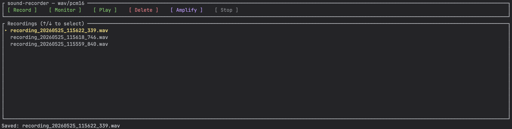

# Sound Recorder

`sound-recorder` is a Rust TUI audio application.

Current user workflow is TUI-first:

- app startup opens the TUI directly,
- the UI provides `Record`, `Monitor`, `Play`, `Delete`, `Amplify`, and `Stop` actions,
- the UI shows a list of stored `WAV` files,
- each `Record` → `Stop` cycle creates one new `WAV` file,
- `Delete` removes the selected recording from disk,
- `Amplify` scales the volume of the selected recording by 2x.

Detailed target behavior is documented in specs:
- [001-terminal-audio-recorder-player](specs/001-terminal-audio-recorder-player)
- [002-tui-recorder-ui](specs/002-tui-recorder-ui)`specs/002-tui-recorder-ui/spec.md`
- [003-continuous-recording](specs/003-continuous-recording)`specs/specs/003-continuous-recording)003-tui-recorder-ui/spec.md`
- [004-audio-format-compression](specs/004-audio-format-compression)

## Features

- Launches directly into the TUI on startup.
- Supports end-to-end recording with `Record` and `Stop` actions.
- Supports playback of stored `WAV` files via the `Play` action ('p' key).
- Supports cycling playback modes (Single, Continuous, Loop) by pressing 'p' during playback.
- Supports deleting recordings via the `Delete` action ('d' key).
- Supports amplifying recordings (2x volume) via the `Amplify` action ('a' key).
- Displays and refreshes the recordings list in the UI.
- Continuous (sound-activated) capture via the `Monitor` action.
- Configurable output audio format and compression profile via `config/audio.conf`.

## Audio output profile

Defaults for new recordings live in `config/audio.conf`:

```
format=wav
compression=pcm16
```

Supported values:

| Key           | Allowed values                                |
|---------------|-----------------------------------------------|
| `format`      | `wav`                                         |
| `compression` | `pcm8`, `pcm16`, `pcm24`, `float32`           |

If the file is missing the app falls back to `wav` + `pcm16` and notes this in
the status bar. If it is present but invalid the app refuses to record or
monitor until it is fixed. Existing recordings are never modified when the
config file changes.

## Development

This project is based on SSD(Spec Driven Development), see: https://github.com/github/spec-kit

The development workflow follows these phases using Speckit commands:

### 1. Specification Phase
Create or update a feature specification from a natural language description.
```bash
/speckit.specify "description of the feature"
```

### 2. Planning Phase
Generate technical design artifacts (research, data model, contracts) based on the specification.
```bash
/speckit.plan
```

### 3. Task Phase
Break down the implementation plan into actionable tasks.
```bash
/speckit.tasks
```

### 4. Implementation Phase
Execute the tasks and implement the feature.
```bash
/speckit.implement
```

## Build

```bash
cargo build
```

## Look

